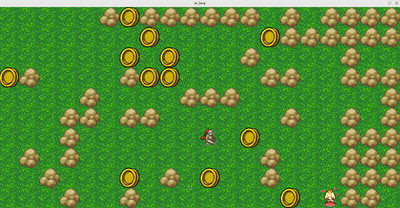

# 42-So_long
# 🎮 So_long

A small 2D game in C using the school’s graphics library (mlx), where the player collects items and reaches the exit.

---

## 🔨 Features
- Automatically generates the map from input, adapting to any map file
- Player movement with keyboard input
- Collectible items
- Exit unlocks once all items are collected
- Validates maps to ensure all collectibles and the exit are reachable
- Player idle animation
---

## 🕹️ GAME
Run the game:
To play the game, a map file must be provided when running the program.  
The file will be parsed and must follow these rules:

- Must be rectangular  
- Use `1` for walls  
- Use `0` for walkable floor  
- Use `P` for the player starting position (exactly one)  
- Use `E` for the exit (exactly one)  
- Use `C` for collectibles (at least one)

If the map is valid and all collectibles and the exit are reachable, the game will launch.
  
Controls:
- W / A / S / D → Move player  
- ESC → Exit game  

---

## 🎥 Demo

---

